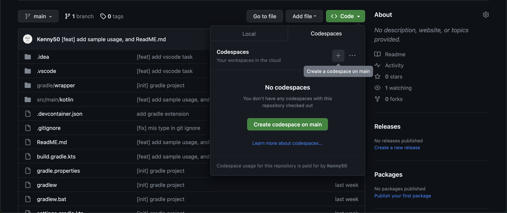
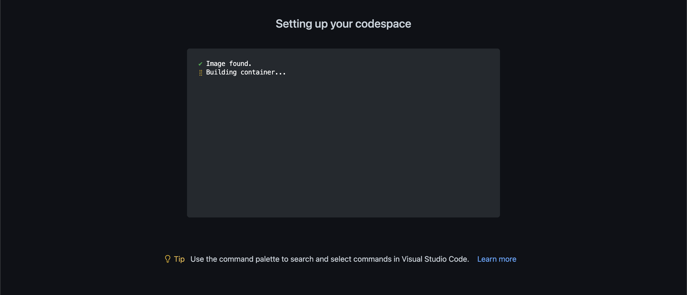

# Online Kotlin Ide, run with CodeSpace

## To run a main function
In your first time access CodeSpace and everytime you modify `build.gradle.kts`, please run `./gradlew build` to update resource.

Type this line in terminal to call Main.kt
`./gradlew run`

for other file contains main function, please type
`./gradlew run -Plaunch=path/filename`

example : 
- `./gradlew run -Plaunch=w0.W0Sample`
- `./gradlew run -Plaunch=Main`

## Environment
runs on Ubuntu, docker VM, we preinstall following packages
- gradle
- git
- curl 
- default-jdk 

Since we install git already, we can update project in CodeSpace, and git commit and push to our project in github.
## Step
Fork this project, in your repository select code > CodeSpace > create codespace on main

waiting the environment

## Attention
Unlike [Intellij](https://www.jetbrains.com/idea/), writing in vscode does not have auto import ...etc.
Remember manually add things like `package ...`, `import ...`.

I recommend using this platform for demonstrate, and using [Intellij](https://www.jetbrains.com/idea/) for development.

## Relevant resource
[GitHub Codespaces documentation](https://docs.github.com/en/codespaces)